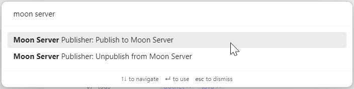
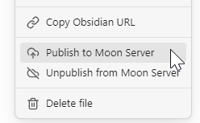

# Moon server publisher

An Obsidian plugin for publishing notes to [Moon server](https://github.com/Dzoukr/MoonServerSpecification) instance.

## Configuration

1. Enter the base URL of your [Moon server](https://github.com/Dzoukr/MoonServerSpecification) instance.
2. Enter the API key for your Moon server instance. _(optional)_ 
3. Enter the API secret for your Moon server instance. _(optional)_ 

## Usage

### Publishing a note
1. Open the Obsidian note you want to publish. 
2. Open the command palette and run the `Publish to Moon server` command.
3. The note will be published to your Moon server instance and the ID will be applied to note as property. 

### Unpublishing a note
1. Open the Obsidian note you want to unpublish.
2. Open the command palette and run the `Unpublish from Moon server` command.
3. The note will be unpublished from your Moon server instance and the ID property will be removed from the note.

Alternatively you can use command from the note's context menu.

